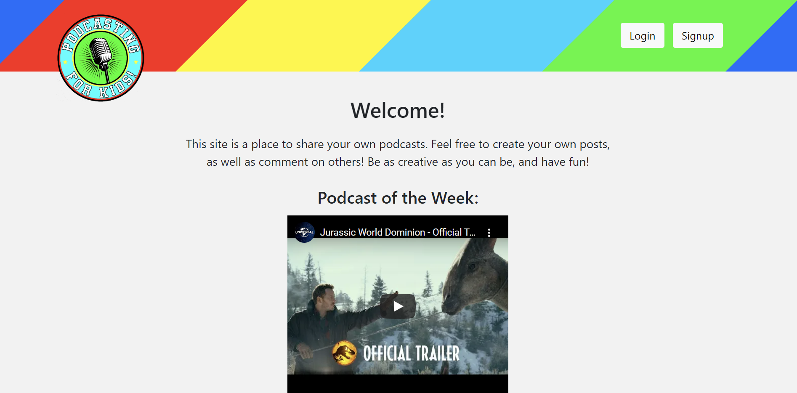
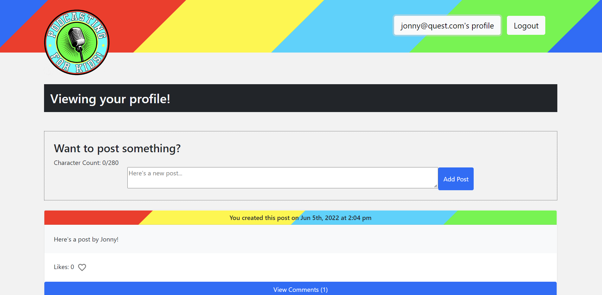

# Podcasting for Kids!

## Description
<H4> This application is directed towards kids, where the user will be able to easily sign up and make posts with a focus on podcasting!  When they make a post, it will display on the home page as well as their profile.  The user will have the option to comment on, like, or delete their own post.  When they click on another user's post, they will be directed to a page displaying that single post.  They can then comment and like the other user's posts. The user can navigate to their profile page any time via the nav bar to view posts made by that account, and be able to navigate to the homepage via the logo.

## Table of Contents
[Description](#description)

[Technology](#technology)

[Collaborators](#collaborators)

[App Screenshots](#app-screenshots)

[Live-Link](#live-link)

[Questions](#questions)

[Special Thanks](#special-thanks)

## Technology:
- React
- Bootstrap (React)
- Linkify
- Font Awesome
- Apollo Server
- Mongoose
- GraphQl

## Collaborators:
- Fong (fchang1720)
- Kellen (kellena)
- Hannah (hlodg)
- Griffin (GLundy99)
- Cumar (ccccumar)

## App Screenshots

## Live-Link
Click [here](https://radiant-mountain-18459.herokuapp.com/) to view our website!

## Questions
Any questions regarding this application can be directed to <fchang1720@gmail.com>!

## Special Thanks
A special credit goes to Leonardo Bravo  for his developer documentation on setting up a Voice Recorder with React.  This will help users of our application to record their own voice clips within the site, and they'll be able to post their newly created sound bytes.  [Here's](https://dev.to/jleonardo007/create-a-voice-recorder-with-react-32j6) a link to this documentation!